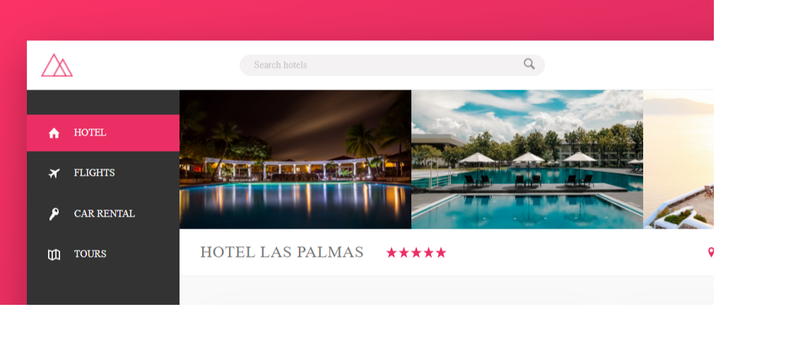

<!-- Please update value in the {}  -->

<h1 align="center">Trillo</h1>

<div align="center">
  <h3>
    <a href="https://trillo-hotmann.netlify.app">
      Demo
    </a>
    <span> | </span>
    <a href="https://github.com/Hotmann/trillo.git">
      Solution
    </a>
  </h3>
</div>

<!-- TABLE OF CONTENTS -->

### Table of Contents

- [Overview](#overview)
- [Built With](#built-with)
- [Features](#features)
- [How To Use](#how-to-use)
- [Acknowledgements](#acknowledgements)
- [Contact](#contact)

<!-- OVERVIEW -->

## Overview



- Where can I see your demo?
  https://trillo-hotmann.netlify.app

- What was your experience?  
  It was a nice experience as i was able to work with flexbox and position.  
  Trying to get a good layout for the diferent brekpoint was really hetic but interesting.  
  Building the navigation section and the button was really cool.

- What have you learned/improved?  
  I improved on useage of flexbox.  
  I improved on structuring of sass files.  
  I learnt how to use CSS variables.  
  I learnt how to use command prompt to create and compile a project.  
  I learnt "xlink:href" only works on a web server.

## Built With

- HTML
- CSS
- CSS Preprocessor (SASS)

## Features

<!-- List the features of your application or follow the template. Don't share the figma file here :) -->

This application/site was created as a project the online course I took (ADVANCE CSS AND SASS by Jonas Scmedtmann. The challenge was to build a fictional boooking app UI.

## How To Use

<!-- Example: -->

To clone and run this application, you'll need [Git](https://git-scm.com) and [Node.js](https://nodejs.org/en/download/) (which comes with [npm](http://npmjs.com)) installed on your computer. From your command line:

```bash
# Clone this repository
$ git clone https://github.com/Hotmann/trillo.git

# Install dependencies
$ npm install

# Run the app
$ npm start
```

## Acknowledgements

<!-- This section should list any articles or add-ons/plugins that helps you to complete the project. This is optional but it will help you in the future. For example -->

- [Node.js](https://nodejs.org/)
- [Marked - a markdown parser](https://github.com/chjj/marked)

## Contact

- Website [your-website.com](https://{your-web-site-link})
- GitHub [@Hotmann](https://github.com/Hotmann)
- Twitter [@\_hotmann](https://twitter.com/_Hotmann)
